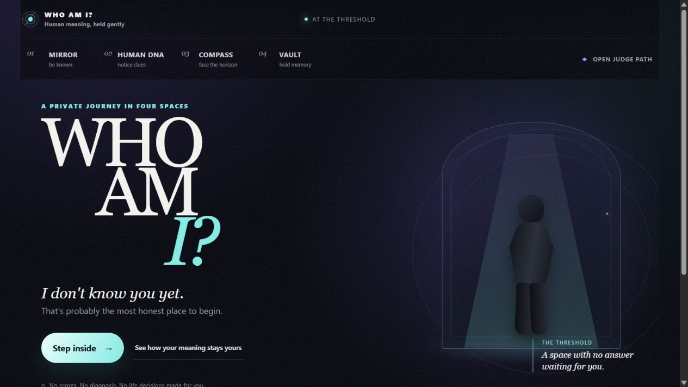
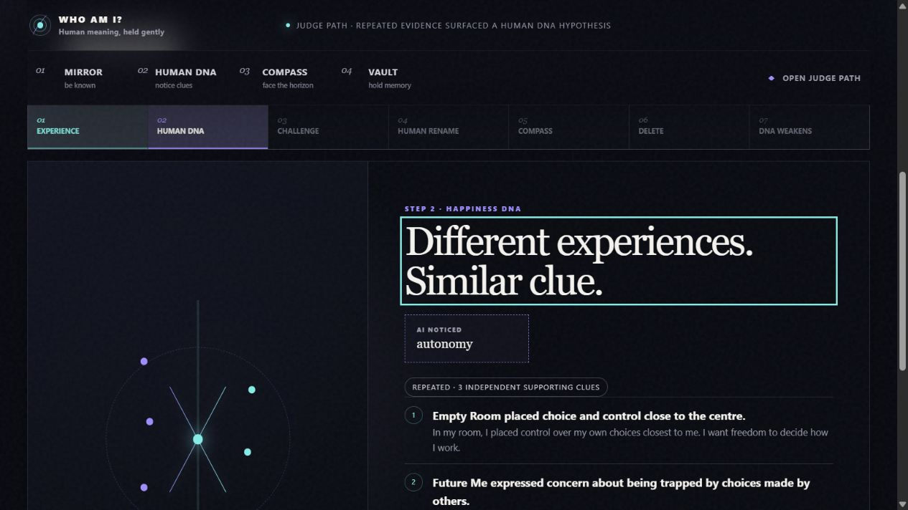
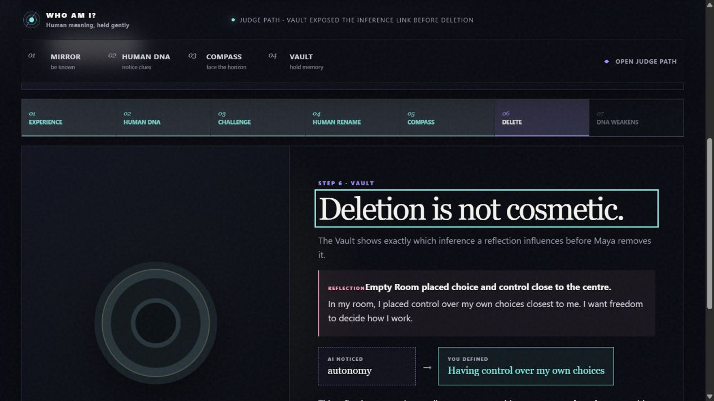
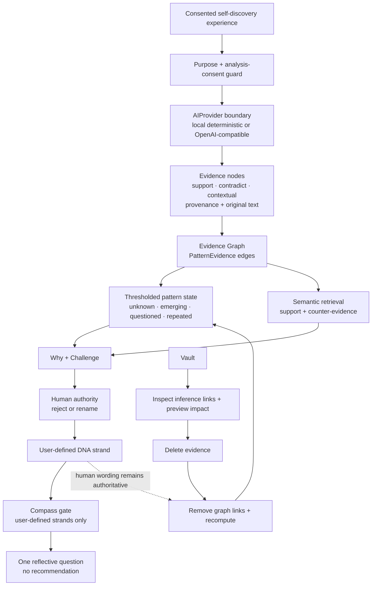
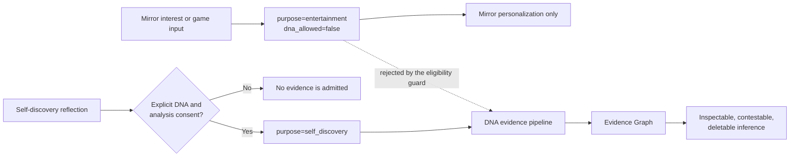

# WHO AM I?

<div align="center">

## AI finds the clues. You own the meaning.

**A cinematic, evidence-backed self-discovery experience where AI must explain itself, seek counter-evidence, yield authorship to the human, and lose influence when supporting memory is deleted.**

WHO AM I? is not a personality test, happiness score, diagnosis, or decision engine. It treats AI interpretations as contestable hypotheses and keeps the human in authority from the first clue to the final reflection.

### [Enter the live experience](https://who-am-i-1z33.onrender.com) · [Run the 3-minute judge demo](https://who-am-i-1z33.onrender.com/demo)

[](https://github.com/sasipriya1221/WHO-AM-I/actions/workflows/ci.yml)

</div>

> **Render cold start:** the live service may sleep while idle. If the first request is slow, allow up to a minute for it to wake and then refresh once.

## The experience, not a dashboard

The images below are captures from the deployed redesigned application and its judge path—not concept art or fabricated mockups.



<table>
  <tr>
    <td width="50%"></td>
    <td width="50%"></td>
  </tr>
  <tr>
    <td align="center"><strong>Human DNA</strong><br>Different experiences form an explainable, still-contestable clue.</td>
    <td align="center"><strong>Compass</strong><br>The user's wording crosses the boundary; an AI label does not.</td>
  </tr>
</table>



## Mirror → Human DNA → Challenge / Human Rename → Compass → Vault

| Space | What happens | Boundary that matters |
|---|---|---|
| **Mirror** | Low-pressure, interest-aware play makes the space feel familiar and progressively completes the reflection puzzle. | Mirror records are stored for `entertainment` with `dna_allowed=false`; they cannot create Human DNA evidence. |
| **Human DNA** | With explicit analysis consent, separate reflections become provenance-carrying support, contradiction, or contextual evidence. Repeated clues can become pattern hypotheses. | A single reflection cannot become a repeated pattern, and every AI label remains a hypothesis. |
| **Challenge / Human Rename** | **Why** exposes the source reflections. **Challenge** retrieves both supporting and counter-evidence. The person can reject the pattern or replace the AI label with their own words. | A rejected pattern is retired. A renamed strand becomes `user_defined`; human authorship outranks automatic recomputation. |
| **Compass** | The person brings a current life chapter to a cinematic road-and-horizon reflection. Compass asks one tension-revealing question using the person's wording. | Compass refuses unconfirmed AI hypotheses and never recommends a major decision. |
| **Vault** | Entertainment memory, self-discovery evidence, and DNA state remain inspectable. The user can preview exactly what a reflection affects before deleting it. | Deletion removes the evidence and graph links, recomputes the pattern, and preserves the user's own definition while the AI inference weakens. |

## Architecture: evidence before interpretation

The product's core is an **Evidence Graph**, implemented through evidence records, pattern-evidence relationships, pattern states, and DNA strands. Provider output never becomes identity directly; application-controlled gates determine what is eligible, how much support is enough, and who has final authority.



The implemented repeated-pattern threshold requires at least three supporting evidence items from three distinct experiences across at least two experience types. Contradicting evidence moves an eligible pattern to `questioned`; it is surfaced rather than hidden.

## Privacy is a data-flow rule

The central invariant is enforced in stored purpose fields, the DNA eligibility guard, and regression tests:

> Data collected to entertain the user can personalize the experience, but can never be used to psychologically interpret the user.



Purpose and consent are checked **before** a provider receives a reflection. Mirror records are therefore blocked from both the deterministic and hosted AI paths.

## Technology stack

| Layer | Implemented with | Responsibility |
|---|---|---|
| Experience | Semantic HTML, CSS, vanilla JavaScript | Cinematic Portal, Mirror, Human DNA, Compass, Vault, and responsive judge path |
| API | Python 3.11+, FastAPI, Pydantic | Journey endpoints, validation, safety and ownership boundaries |
| Persistence | SQLAlchemy 2, Alembic | Users, purpose-bound experiences, evidence, graph links, patterns, strands, and life chapters |
| Database | SQLite by default; `DATABASE_URL` override with PostgreSQL driver included | Local zero-config storage or an externally configured database |
| Evidence / AI | Provider protocol, deterministic local provider, OpenAI-compatible provider, `httpx` | Structured extraction and semantic support/counter-evidence retrieval |
| Verification | Pytest, Node syntax checks, GitHub Actions | API, privacy, cinematic UI, accessibility/responsiveness, judge journey, and deletion contracts |
| Delivery | Docker, Docker Compose, Render | Reproducible packaging and hosted demonstration |

## Deterministic demo mode vs real AI provider mode

There are two provider modes behind the same evidence and authority controls. They are deliberately distinct.

| | Deterministic / offline mode | Pluggable real AI mode |
|---|---|---|
| Configuration | `WHOAMI_AI_PROVIDER=local` (the default) | `WHOAMI_AI_PROVIDER=openai_compatible` (or `openai`) |
| Credentials / network | No external AI credentials or provider calls | Requires `WHOAMI_AI_API_KEY` and access to an OpenAI-compatible Chat Completions + Embeddings API |
| Extraction | Fixed, transparent concept/keyword mapping | Configured chat model returns structured evidence candidates |
| Embeddings | Deterministic 96-dimensional hashing vectors | Configured embeddings model |
| Intended use | Local development, CI, reproducible evaluation, and credential-free demos | Testing the same product controls with hosted language and embedding models |
| What remains application-controlled | Purpose and consent gates, evidence types and provenance, pattern thresholds, user rejection/rename authority, Compass boundary, and inference-aware deletion | The same controls; provider output cannot bypass them |

The `/demo` route adds a **fixed judge story** on top of the default local provider. `POST /api/v1/demo/seed` creates a fresh Maya journey with three independent supporting reflections and separate counter-evidence; the UI then exercises the real Why, Challenge, Human Rename, Compass, Vault impact, deletion, and recomputation endpoints.

For an exactly reproducible judge or CI run, leave `WHOAMI_AI_PROVIDER` unset or set it to `local`. Provider configuration is global to the backend, so a deployment switched to `openai_compatible` also uses that provider for semantic retrieval during `/demo`.

### Real provider configuration

Set credentials in the shell or deployment environment—never commit them:

```bash
export WHOAMI_AI_PROVIDER=openai_compatible
export WHOAMI_AI_API_KEY=your-provider-key
export WHOAMI_AI_BASE_URL=https://api.openai.com/v1
export WHOAMI_LLM_MODEL=gpt-4.1-mini
export WHOAMI_EMBEDDING_MODEL=text-embedding-3-small
```

| Variable | Required | Default / meaning |
|---|---:|---|
| `WHOAMI_AI_PROVIDER` | No | `local`; use `openai_compatible` or `openai` for the hosted adapter |
| `WHOAMI_AI_API_KEY` | Hosted mode | No default; hosted-provider initialization rejects a missing key |
| `WHOAMI_AI_BASE_URL` | No | `https://api.openai.com/v1` |
| `WHOAMI_LLM_MODEL` | No | `gpt-4.1-mini` |
| `WHOAMI_EMBEDDING_MODEL` | No | `text-embedding-3-small` |
| `DATABASE_URL` | No | `sqlite:///./who_am_i.db` |

## Run locally

### Prerequisites

- Python 3.11 or newer
- `pip`
- Node.js only if you want to run the frontend syntax checks locally

```bash
cd backend
python -m venv .venv
```

Activate the environment with the command for your platform:

```bash
# macOS / Linux
source .venv/bin/activate
```

```powershell
# Windows PowerShell
.venv\Scripts\Activate.ps1
```

Then install, migrate, and start the application:

```bash
pip install -e ".[dev]"
alembic upgrade head
uvicorn app.main:app --reload --port 8080
```

Open:

- Experience: <http://127.0.0.1:8080>
- Deterministic judge path: <http://127.0.0.1:8080/demo>
- Interactive API documentation: <http://127.0.0.1:8080/docs>
- Health check: <http://127.0.0.1:8080/health>

## Docker

```bash
docker compose up --build
```

Then open <http://127.0.0.1:8080>. The container runs Alembic migrations before starting Uvicorn and respects the platform `PORT` variable, defaulting to `8080`.

## Tests and CI

```bash
cd backend
pytest -q

cd ..
node --check frontend/app.js
node --check frontend/vault.js
node --check frontend/demo.js
```

The regression suite covers API behavior, migration startup, the complete seven-step judge journey, purpose-bound entertainment data, semantic counter-evidence, human ownership, Compass boundaries, responsive/accessibility safeguards, and inference-aware deletion. GitHub Actions runs the migrations, full Pytest suite, and syntax checks for every frontend JavaScript bundle on pushes and pull requests.

## Health, API, and development reference

Expected `GET /health` response:

```json
{
  "status": "ok",
  "service": "who-am-i",
  "version": "0.2.0"
}
```

### Key API surfaces

| Area | Endpoints |
|---|---|
| Judge path | `POST /api/v1/demo/seed` |
| Mirror | `POST /api/v1/mirror/{user_id}/interests`, `GET /api/v1/mirror/{user_id}/game` |
| Human DNA | consent, experience creation, patterns, Why/evidence, Challenge, rejection, strands, Human Rename, and Blind Spot under `/api/v1/dna/{user_id}` |
| Compass | `POST /api/v1/compass/{user_id}/chapters`, `POST /api/v1/compass/{user_id}/reflect` |
| Vault | inference map, deletion impact preview, and delete-with-recalculation under `/api/v1/vault/{user_id}` |
| Safety | `POST /api/v1/safety/check` flags high-risk text with `allow_dna_processing=false` |

FastAPI exposes the complete, executable schema at `/docs` and `/openapi.json`.

### Repository layout

```text
frontend/                 Cinematic single-page experience and judge path
backend/app/api/v1/       Journey, demo, Compass, and Vault endpoints
backend/app/ai/           Local and OpenAI-compatible provider adapters
backend/app/services/     Evidence retrieval, eligibility guard, and DNA engine
backend/app/models/       Purpose-bound data and Evidence Graph entities
backend/alembic/          Database migrations
backend/tests/            API, product-contract, privacy, and deletion regressions
.github/workflows/ci.yml  Continuous verification
```

## Hackathon proof

The implemented proof is intentionally focused: **Mirror → Human DNA → Challenge / Human Rename → Compass → Vault**. It demonstrates that useful AI reflection does not require machine certainty—the system can expose its evidence, look for reasons it may be wrong, let the person define the meaning, refuse to make the decision, and surrender influence when memory is removed.
